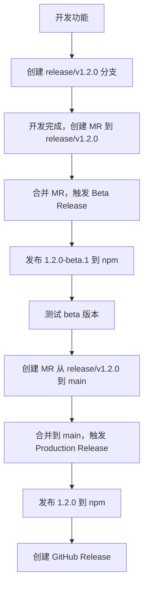

# GitHub Actions 工作流说明

本项目使用两个专门的 GitHub Actions 工作流来处理不同的发布场景：

## 工作流文件

### 1. Beta Release (`.github/workflows/beta-release.yml`)

**触发条件：** 当 MR 合并到带有 `release/` 前缀的分支时

**功能：**
- 自动发布 beta 版本到 npm，使用 `beta` tag
- 版本号规则：`x.x.x-beta.x`
- 自动创建对应的 git tag
- 自动提交版本更新

**使用场景：**
```bash
# 开发流程
git checkout -b release/v1.2.0
# 进行开发...
git push origin release/v1.2.0
# 创建 MR 到 release/v1.2.0 分支
# 合并后自动触发 beta 发布
```

### 2. Production Release (`.github/workflows/production-release.yml`)

**触发条件：** 当带有 `release/` 前缀的分支合并到 `main` 分支时

**功能：**
- 自动发布正式版本到 npm，使用 `latest` tag
- 版本号规则：中版本升级（minor version bump）
- 自动创建对应的 git tag
- 自动创建 GitHub Release
- 自动提交版本更新

**使用场景：**
```bash
# 从 beta 版本发布正式版本
git checkout main
git merge release/v1.2.0
git push origin main
# 自动触发生产版本发布
```

## 版本号规则

### Beta 版本
- 格式：`x.x.x-beta.x`
- 示例：`1.2.0-beta.1`, `1.2.0-beta.2`
- 每次 beta 发布，beta 号递增

### 生产版本
- 格式：`x.x.x`
- 示例：`1.2.0`, `1.3.0`
- 从 beta 版本升级时，minor 版本号递增，patch 版本号重置为 0

## 环境变量要求

确保在 GitHub 仓库的 Settings > Secrets and variables > Actions 中配置以下密钥：

- `NPM_TOKEN`: NPM 发布令牌
- `GITHUB_TOKEN`: GitHub 令牌（通常自动提供）

## 注意事项

1. **分支命名规范：** 确保 beta 发布分支以 `release/` 开头
2. **权限要求：** 工作流需要写入权限来创建 tag 和 push 代码
3. **依赖管理：** 使用 yarn 作为包管理器
4. **Lerna 配置：** 项目使用 Lerna 进行 monorepo 管理

## 工作流程示例

