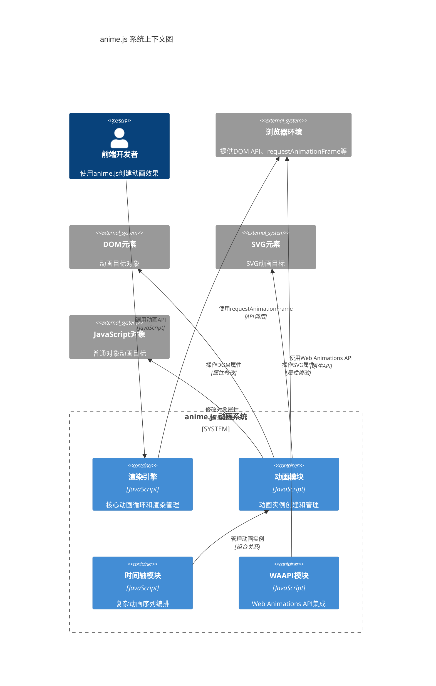
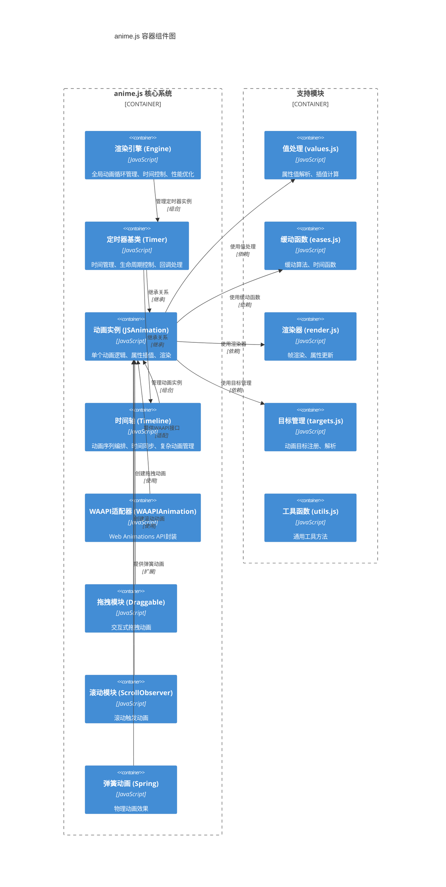
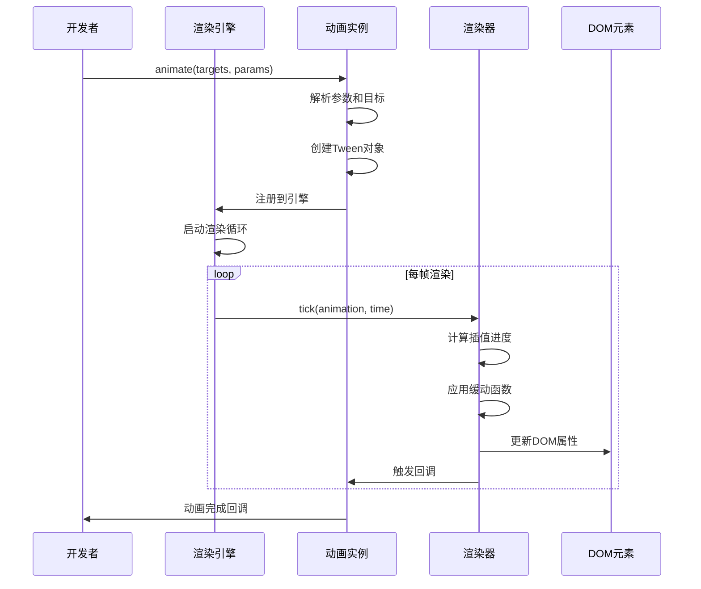
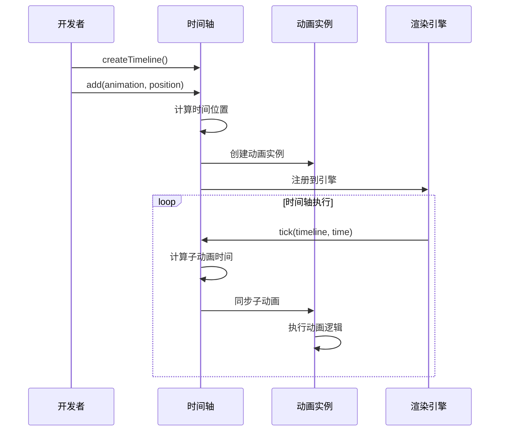
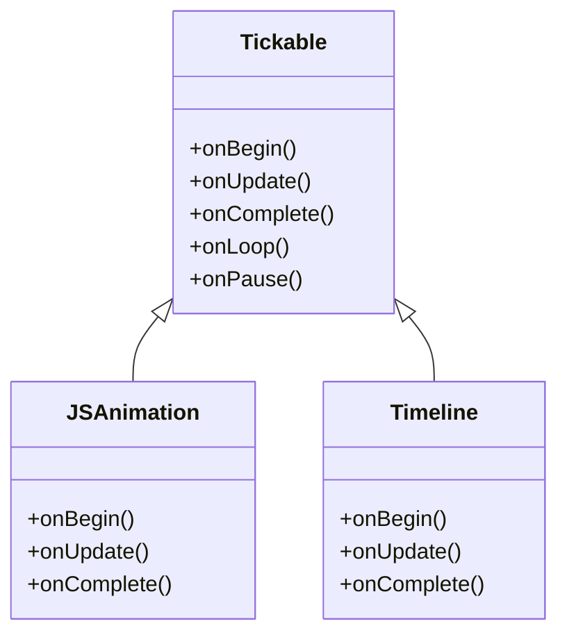
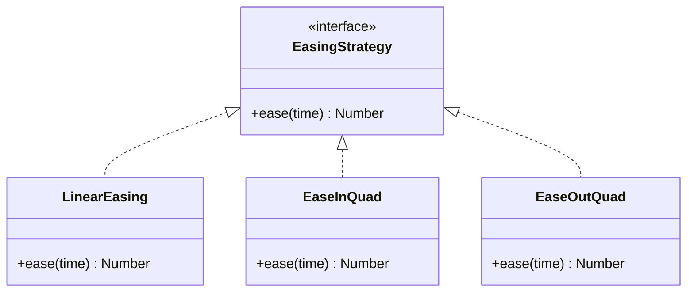
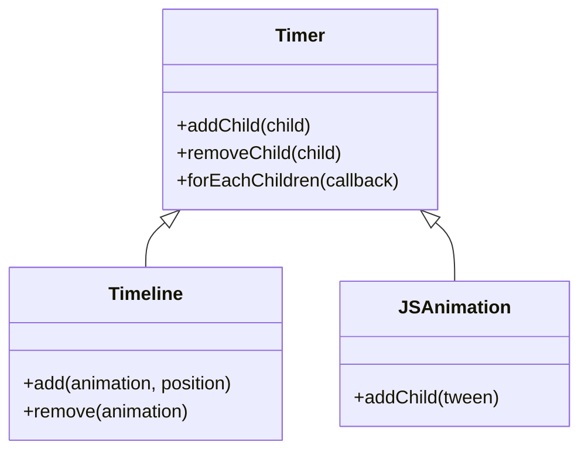
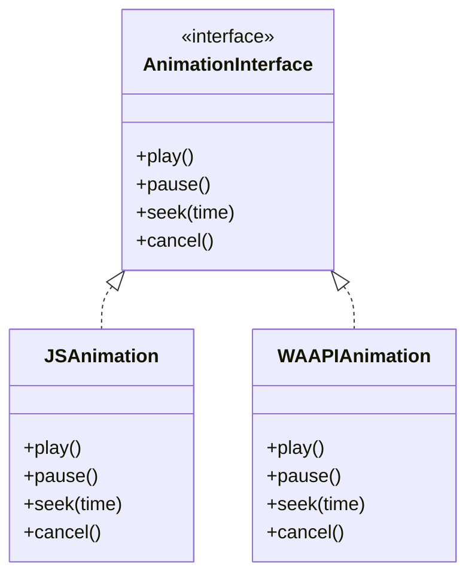

# anime.js 架构与设计分析报告

## 摘要

anime.js 是一个轻量级、高性能的 JavaScript 动画库，专注于提供流畅的 DOM 元素动画、CSS 属性动画、SVG 动画以及 JavaScript 对象动画。该库采用模块化架构设计，通过分层抽象实现了高度的可扩展性和灵活性。核心架构基于时间驱动的渲染引擎，支持复杂的动画编排、时间轴管理和交互式动画。

**核心架构风格**: 分层模块化架构 + 观察者模式 + 策略模式
**主要结论**: anime.js 通过精心设计的抽象层次和模块化架构，在保持高性能的同时提供了丰富的动画功能和良好的开发体验。

## 详细分析

### 1. 系统上下文图



### 2. 容器/组件图



### 3. 核心流程分析

#### 3.1 动画创建与执行流程



#### 3.2 时间轴动画编排流程



### 4. 设计模式识别

#### 4.1 观察者模式 (Observer Pattern)

**应用场景**: 动画生命周期回调管理


**优势**: 提供了灵活的事件处理机制，开发者可以在动画的不同阶段执行自定义逻辑。

#### 4.2 策略模式 (Strategy Pattern)

**应用场景**: 缓动函数和值插值算法


**优势**: 支持多种缓动算法，开发者可以根据需要选择合适的缓动效果。

#### 4.3 组合模式 (Composite Pattern)

**应用场景**: 时间轴和动画的层次结构


**优势**: 允许将简单动画组合成复杂的动画序列，提供了统一的接口。

#### 4.4 适配器模式 (Adapter Pattern)

**应用场景**: WAAPI模块


**优势**: 提供了与Web Animations API的兼容性，同时保持了统一的接口。

### 5. 关键设计决策分析

#### 5.1 模块化与耦合度处理

**设计决策**: 采用高度模块化的架构，每个模块职责单一
- **优势**:
  - 代码可维护性强，模块间耦合度低
  - 支持按需加载，减少包体积
  - 便于测试和调试
- **权衡**:
  - 模块间通信需要明确的接口定义
  - 增加了初始化的复杂性

#### 5.2 可扩展性实现方式

**设计决策**: 通过插件式架构和钩子机制实现扩展
- **插件系统**: 支持自定义缓动函数、值处理器
- **钩子机制**: 提供丰富的生命周期回调
- **组合模式**: 允许创建复杂的动画组合

#### 5.3 错误处理与容错机制

**设计决策**: 采用防御性编程和优雅降级
- **参数验证**: 对所有输入参数进行类型检查
- **默认值处理**: 为缺失参数提供合理的默认值
- **错误恢复**: 动画执行过程中的错误不会影响其他动画

#### 5.4 性能优化关键点

**设计决策**: 多层次的性能优化策略
- **渲染优化**: 使用requestAnimationFrame确保60fps
- **内存管理**: 重用对象，减少GC压力
- **计算优化**: 缓存计算结果，避免重复计算
- **批量更新**: 批量处理DOM更新操作

#### 5.5 接口设计清晰度和一致性

**设计决策**: 统一的API设计模式
- **链式调用**: 支持方法链式调用
- **参数对象**: 使用对象参数提高可读性
- **默认值**: 提供合理的默认配置
- **类型安全**: 完整的TypeScript类型定义

### 6. 关键抽象识别

#### 6.1 Timer基类
```javascript
// 核心抽象：时间管理基类
class Timer extends Clock {
  // 统一的时间控制接口
  play(), pause(), seek(), cancel()
  // 生命周期管理
  onBegin, onUpdate, onComplete
}
```

**作用**: 为所有时间相关的功能提供统一的基础，包括动画、时间轴、定时器等。

#### 6.2 Tween对象
```javascript
// 核心抽象：补间动画对象
const tween = {
  property: 'opacity',
  target: element,
  from: 0,
  to: 1,
  ease: easingFunction,
  duration: 1000
}
```

**作用**: 封装单个属性的动画逻辑，是动画系统的最小执行单元。

#### 6.3 值处理器抽象
```javascript
// 核心抽象：值处理策略
const valueHandlers = {
  NUMBER: numberHandler,
  COLOR: colorHandler,
  UNIT: unitHandler,
  COMPLEX: complexHandler
}
```

**作用**: 统一处理不同类型值的插值计算，支持扩展新的值类型。

### 7. 依赖分析

#### 7.1 内部依赖关系
```
engine.js ← timer.js ← animation.js
engine.js ← timeline.js
animation.js ← values.js, eases.js, render.js
waapi.js ← animation.js (适配器关系)
draggable.js ← animation.js (扩展关系)
```

#### 7.2 外部依赖
- **浏览器API**: requestAnimationFrame, DOM API, Web Animations API
- **无第三方库依赖**: 纯JavaScript实现，无外部依赖

#### 7.3 依赖管理策略
- **模块化导入**: 使用ES6模块系统
- **按需加载**: 支持Tree-shaking优化
- **版本兼容**: 向后兼容的API设计

### 8. 关键优势与潜在风险

#### 8.1 核心优势

1. **高性能**:
   - 优化的渲染循环
   - 智能的帧率控制
   - 内存友好的对象重用

2. **灵活性**:
   - 支持多种动画目标（DOM、SVG、对象）
   - 丰富的缓动函数库
   - 强大的时间轴功能

3. **易用性**:
   - 简洁的API设计
   - 完善的文档和示例
   - 良好的开发体验

4. **可扩展性**:
   - 插件化架构
   - 钩子机制
   - 组合模式支持

#### 8.2 潜在风险与限制

1. **学习曲线**:
   - 复杂的时间轴概念需要时间理解
   - 高级功能的学习成本较高

2. **性能限制**:
   - 大量并发动画可能影响性能
   - 复杂动画序列的内存占用

3. **浏览器兼容性**:
   - 某些高级功能依赖现代浏览器
   - WAAPI功能需要较新的浏览器支持

4. **调试复杂性**:
   - 异步动画的调试相对困难
   - 时间轴动画的问题定位复杂

## 源码阅读指南

为了彻底理解anime.js的架构设计和实现细节，建议按照以下顺序阅读源码：

### 第一阶段：基础概念和核心抽象

#### 1. **类型定义和常量**
```bash
src/types.js      # 理解所有核心类型定义
src/consts.js     # 了解系统常量和枚举值
```
**目的**: 建立对系统核心概念的理解，为后续阅读打下基础。

#### 2. **工具函数和辅助模块**
```bash
src/helpers.js    # 核心工具函数
src/utils.js      # 通用工具方法
```
**目的**: 了解系统的基础工具函数，这些会在后续模块中频繁使用。

### 第二阶段：时间管理和渲染引擎

#### 3. **时钟和定时器系统**
```bash
src/clock.js      # 基础时钟抽象
src/timer.js      # 定时器基类（所有时间相关功能的父类）
```
**目的**: 理解时间管理的基础架构，这是整个动画系统的核心。

#### 4. **渲染引擎**
```bash
src/engine.js     # 全局渲染引擎
src/render.js     # 具体的渲染逻辑
```
**目的**: 理解动画循环和渲染机制，这是性能的关键所在。

### 第三阶段：核心动画功能

#### 5. **值处理和属性系统**
```bash
src/values.js     # 值解析和插值计算
src/properties.js # 属性处理
```
**目的**: 理解动画值的处理逻辑，这是动画效果的核心。

#### 6. **缓动函数系统**
```bash
src/eases.js      # 缓动算法库
```
**目的**: 了解动画的时间曲线和缓动效果实现。

#### 7. **动画实例**
```bash
src/animation.js  # 核心动画类
```
**目的**: 理解单个动画的完整生命周期和实现细节。

### 第四阶段：高级功能和扩展

#### 8. **时间轴系统**
```bash
src/timeline.js   # 时间轴管理
```
**目的**: 理解复杂动画序列的编排和管理。

#### 9. **目标管理**
```bash
src/targets.js    # 动画目标管理
src/animatable.js # 可动画对象抽象
```
**目的**: 了解动画目标的选择和处理机制。

#### 10. **组合和叠加**
```bash
src/compositions.js # 动画组合逻辑
src/additive.js     # 叠加动画效果
```
**目的**: 理解复杂动画效果的组合机制。

### 第五阶段：特殊功能和适配器

#### 11. **WAAPI适配器**
```bash
src/waapi.js      # Web Animations API适配
```
**目的**: 了解与现代浏览器API的集成方式。

#### 12. **交互式功能**
```bash
src/draggable.js  # 拖拽动画
src/scroll.js     # 滚动触发动画
```
**目的**: 理解交互式动画的实现。

#### 13. **物理动画**
```bash
src/spring.js     # 弹簧动画效果
```
**目的**: 了解物理动画的实现原理。

### 第六阶段：系统集成和全局管理

#### 14. **全局状态管理**
```bash
src/globals.js    # 全局配置和状态
src/scope.js      # 作用域管理
```
**目的**: 理解系统的全局状态管理和作用域机制。

#### 15. **特殊功能模块**
```bash
src/svg.js        # SVG动画支持
src/stagger.js    # 错开动画效果
src/transforms.js # 变换处理
src/units.js      # 单位转换
```
**目的**: 了解各种特殊功能的实现。

### 最后：入口和导出

#### 16. **主入口文件**
```bash
src/anime.js      # 主入口文件
```
**目的**: 理解整个库的导出结构和公共API。

### 阅读建议

#### 🔍 **深度阅读策略**
1. **第一遍**: 快速浏览，理解整体结构
2. **第二遍**: 重点关注核心逻辑和算法
3. **第三遍**: 研究设计模式和架构决策

#### 🎯 **重点关注的文件**
- `timer.js` - 理解时间管理的基础
- `animation.js` - 理解动画的核心逻辑
- `engine.js` - 理解渲染循环和性能优化
- `timeline.js` - 理解复杂动画编排

#### 🛠️ **实践建议**
1. **边读边画**: 画出模块关系图
2. **边读边写**: 尝试实现简单的动画功能
3. **边读边测**: 运行examples目录中的示例
4. **边读边问**: 思考设计决策的原因和权衡

#### 📚 **学习目标**
- 理解动画引擎的核心原理
- 掌握高性能渲染的实现技巧
- 学习模块化架构的设计方法
- 了解设计模式在实际项目中的应用

## 结论

anime.js 通过精心设计的模块化架构和丰富的设计模式应用，成功构建了一个高性能、灵活且易用的动画库。其核心优势在于：

1. **架构设计优秀**: 分层清晰，模块职责单一，耦合度低
2. **性能表现突出**: 优化的渲染循环和内存管理
3. **功能丰富完整**: 支持多种动画类型和复杂场景
4. **扩展性良好**: 插件化架构支持自定义扩展

**建议**:
- 对于简单动画需求，anime.js提供了直观易用的API
- 对于复杂动画项目，建议充分利用时间轴和组合功能
- 在性能敏感场景下，注意控制并发动画数量
- 建议在项目初期就规划好动画架构，充分利用anime.js的模块化特性

anime.js 是一个成熟、稳定且功能强大的动画库，适合各种规模的Web项目使用。